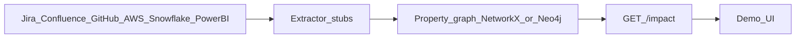

# data-impact-graph

[](https://github.com/pcloudata/data-impact-graph/actions/workflows/ci.yml)

Cross-stack **impact, ownership, and lineage** for data platform teams — modeled as a minimal property graph over Jira, Confluence, GitHub, AWS, Snowflake, and Power BI.

This is a **showcase / reference design**, not a production catalog. It answers questions like:

- If we change `RAW.ORDERS`, what pipelines, tables, and Power BI reports break?
- Which datasets have no owning team?
- Which open Jira bugs track jobs that feed P1 reports?

## Architecture



| Stage | What happens |
|-------|----------------|
| Tools | Source systems of record |
| Extractors | Normalize IDs → nodes/edges (`snowflake`, `powerbi`, `jira`) |
| Graph | Ownership + lineage + ticket/report links |
| `/impact` | Blast radius JSON for a dataset |
| UI | Dropdown demo at `/` |

## Interview talk track (30–60s)

**Problem.** Platform work spans Jira, Confluence, GitHub, AWS, Snowflake, and Power BI. Blast radius is tribal knowledge.

**Graph.** Encode those systems as nodes and typed edges (owns, writes, derives_from, uses, tracks) with stable IDs and provenance.

**Punchline.** Change impact on `acme.raw.sales.orders` surfaces curated/mart tables, `orders_etl`, and P1 **Finance Close** in one hop path — see [docs/screenshots/demo_queries.txt](docs/screenshots/demo_queries.txt).

> Full script: [docs/talk-track.md](docs/talk-track.md) · Change runbook: [docs/runbook-change-impact.md](docs/runbook-change-impact.md)

## When *not* to build this

Prefer Snowflake native lineage + a data catalog (DataHub, OpenMetadata, Alation) + Confluence glossary when:

- Pain is mostly “find the right table/doc,” not multi-hop impact across tickets/repos/jobs/BI
- One warehouse and one orchestrator already cover ~80% of lineage questions
- Nobody will own edge freshness (entity resolution, schema drift)
- Success = better dashboards, not safer changes or clearer ownership

Build (or extend a catalog graph) when change impact routinely crosses **AWS → Snowflake → Power BI → Jira/GitHub**, and ownership is fragmented across CODEOWNERS, warehouse tags, and tickets.

## Quick start

On macOS, use **`python3`** and the project venv (`python` / bare `pytest` are often missing from PATH).

```bash
python3 -m venv .venv
source .venv/bin/activate
python -m pip install -r requirements.txt
```

### Option A — Neo4j (recommended for demos)

```bash
# Requires Docker
docker compose up -d

# Load schema constraints + seed data
cat graph/constraints.cypher graph/seed.cypher | docker compose exec -T neo4j cypher-shell -u neo4j -p impactgraph

# Run a sample query
docker compose exec neo4j cypher-shell -u neo4j -p impactgraph -f /var/lib/neo4j/import/queries/01_blast_radius.cypher
```

Browser UI: [http://localhost:7474](http://localhost:7474) — user `neo4j` / password `impactgraph`.

### Option B — No Docker (Python walkthrough)

```bash
source .venv/bin/activate
python scripts/demo_queries.py
```

### Option C — Impact API + clickable UI

```bash
source .venv/bin/activate
uvicorn api.main:app --reload --port 8000
```

- UI: [http://127.0.0.1:8000/](http://127.0.0.1:8000/)
- API: `curl "http://127.0.0.1:8000/impact?dataset=acme.raw.sales.orders"`

Sample response: [docs/screenshots/impact_api.json](docs/screenshots/impact_api.json).

Walk through a PR change: [docs/runbook-change-impact.md](docs/runbook-change-impact.md).

### Extractor stubs

```bash
source .venv/bin/activate
python -m extractors.snowflake --pretty
python -m extractors.powerbi --pretty
python -m extractors.jira --pretty

# Production-shaped ingest: extract → upsert into NetworkX
python scripts/merge_snowflake_extract.py --empty --pretty
```

- Snowflake: mocked INFORMATION_SCHEMA → `Dataset` + `DERIVES_FROM`
- Power BI: mocked Admin Scanner → `Report` / `SemanticModel` + `USES` / `BINDS`
- Jira: mocked JQL search → `Ticket` + `TRACKS`

### Tests

```bash
source .venv/bin/activate
pytest -q
```

## What’s in the box

| Path | Purpose |
|------|---------|
| [`docs/schema.md`](docs/schema.md) | v0 node/edge types + ID conventions |
| [`docs/ingest-map.md`](docs/ingest-map.md) | Mock source → graph mapping |
| [`docs/go-no-go.md`](docs/go-no-go.md) | Leadership checklist |
| [`docs/talk-track.md`](docs/talk-track.md) | 30–60s interview script |
| [`docs/runbook-change-impact.md`](docs/runbook-change-impact.md) | PR → `/impact` → who to ping |
| [`docs/screenshots/`](docs/screenshots/) | Captured demo + social preview image |
| [`web/`](web/) | Tiny impact UI |
| [`graph/seed.cypher`](graph/seed.cypher) | Synthetic but realistic demo graph |
| [`graph/queries/`](graph/queries/) | Impact / ownership / governance Cypher |
| [`fixtures/`](fixtures/) | JSON stand-ins for tool extracts |
| [`extractors/`](extractors/) | Snowflake / Power BI / Jira stubs |
| [`scripts/merge_snowflake_extract.py`](scripts/merge_snowflake_extract.py) | Extract → NetworkX upsert path |
| [`api/main.py`](api/main.py) | FastAPI `/`, `/datasets`, `/impact` |
| [`tests/test_smoke.py`](tests/test_smoke.py) | Pytest smoke suite |
| [`.github/workflows/ci.yml`](.github/workflows/ci.yml) | Demo + extractors + pytest |

## Example blast radius

```text
Jira DATA-123 ──TRACKS──▶ Confluence Spec
                              │
                              DESCRIBES
                              ▼
GitHub data-platform ──IMPLEMENTS──▶ Glue orders_etl ──WRITES──▶ ANALYTICS.ORDERS
                                                                      ▲
RAW.ORDERS ──────────────────────────DERIVES_FROM─────────────────────┘
                                                                      │
Team Finance Data ──OWNS──▶ ANALYTICS.ORDERS ◀──USES── Power BI Finance Close
```

## Design principles

1. **IDs over names** — Snowflake FQNs, ARNs, Power BI IDs, issue keys; names are display-only.
2. **Edges carry provenance** — `source`, `as_of`, `confidence` on every relationship.
3. **Table-level first** — column lineage is v0.5+ (noisy and expensive).
4. **Catalog-friendly** — this graph complements a catalog; it does not replace Snowflake or Power BI.

## GitHub profile / social preview

1. Pin **data-impact-graph** on https://github.com/pcloudata (Customize pinned repositories).
2. Set social preview image: repo **Settings → General → Social preview** → upload [`docs/screenshots/social-preview.png`](docs/screenshots/social-preview.png).

## License

MIT
